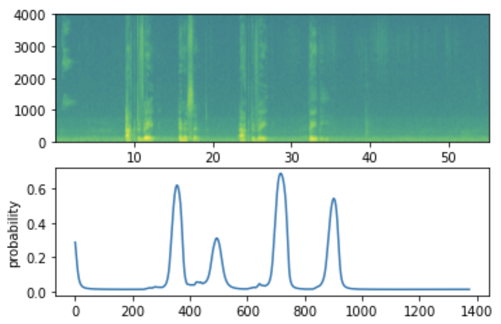

# Gated recurrent units: Trigger word detection
We will build a speech dataset and implement a recurrent neural network (RNN) for trigger word detection. Trigger word detection is the technology that allows devices like Amazon Alexa, Google Home, Apple Siri, and Baidu DuerOS to wake up upon hearing a certain word. 

Our trigger word will be "activate". The algorithm will trigger a chime when it detects someone saying "activate".

We will perform following tasks:
- Synthesize and process audio recordings to create train and development datasets
- Train a trigger word detection model and make predictions

I did this project in the [Sequence Models](https://www.coursera.org/learn/nlp-sequence-models) course as part of the [Deep Learning Specialization](https://www.coursera.org/specializations/deep-learning).

## Dataset
We synthesize a training dataset by mixing three types of audio clips:
- Positive examples of people saying the word "activate". 
- Negative examples of people saying random words other than "activate". 
- Clips of background noise in different environments

For testing predictions, we use actual recordings.

## Recurrent neural network with GRU layers

We build a unidirectional RNN that will ingest the spectrogram of an audio clip and output a signal when it detects the trigger word.

## Example of detecting trigger words

Given the spectogram (the top figure), which tells us how much different frequencies are present in an audio clip at any moment in time, the model outputs the probability of the trigger word having been said at each time step (the bottom figure).

